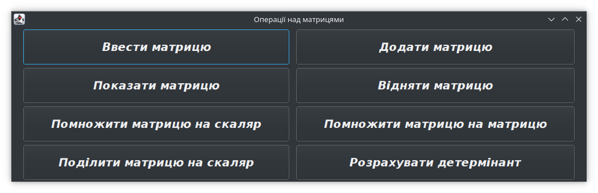

Операції над матрицями
======================

Даний програмний проект дозволяє виконувати такі операції
над матрицями:

 * ввід і вивід матриць;
 * додавання і віднімання матриць;
 * множення матриці на скаляр;
 * матричний добуток;
 * розрахунок детермінанта (визначника).

Вид програми показаний на знімку екрана.

При роботі з програмою існують наступні обмеження:

 * розмір матриці не може перевищувати 19x19;
 * будь-які операції доступні лише після введення матриці;
 * елементами матриці можуть бути будь-які числа з плаваючою комою,
   окрім нескінченості і не-числа (NaN);
 * детермінант може бути розрахований лише для квадратних матриць.
